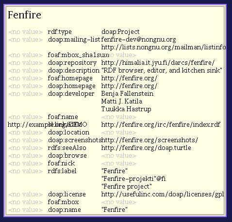

=============================================================
Lecture notes for the fourth lecture of the identities course
=============================================================

:Lecture date: 2005-04-14

m:About this lecture (10 minutes)
=================================

In the previous lectures, we couldn't yet offer you a version
of Fenfire to play with, because for legal reasons we couldn't publish
the user-level application itself: there is a patent on some of the
visualizations we use. To give you something to play with,
we have written a public version of Fenfire for this lecture,
which does not use the code related to the patent. 

This is a very early version and doesn't work great -- we only
threw something together this week... We hope to improve it a lot soon.
In any case, you can use it to navigate an RDF graph already
(there isn't a good interface for changing a graph, yet).

In the following weeks, we would like to program code with you
for an `applitude`_ for Fenfire, i.e., the equivalent of an application
in a normal desktop environment, but integrated with the rest of Fenfire.
The applitude we want to create is a tool for setting up groups
of people, for example a group of students working together
on a course project. ;-) You should be able to

- list the people in your group
- create a mailing list
- list ideas and feedback about them
- make a schedule for implementing them
- publish this information as RDF and allow other people
  to download and view it, for example through Fenfire

.. _applitude: http://fenfire.org/manuscripts/2004/hyperstructure/#an-item-based-user-interface

The topic of this lecture will be to create a small view ("representation view")
for some RDF data that can be used in Fenfire. We hope that
during the next week you will install the public version of Fenfire
and develop your own similar small view based on it.

b:The public Fenfire (10-15 minutes)
====================================

Get it from

    http://himalia.it.jyu.fi/~benja/fenfire-2005-04-14.zip

Unzip, change into the ``fenfire-2005-04-14`` directory, and run::

    java -jar fenfire-snapshot-2005-04-14.jar demo.turtle

You should see something like this (`big version <screen1.png>`_):

In the middle, you see a box with information about the thing
identified by on RDF node, in this case the Fenfire project:

(The overlapping text on the second line is a bug, sorry.)

The first line ("Fenfire project") tells you the thing you are looking at.
The smaller lines below it tell you the relationships between this thing
and other things; the column in the middle tells you the relationship name,
the column on the left tells you which things are related to this one,
and the column on the right tells you which things this thing is related to.

Without the bug, the table here would look like this:

+-------------------------+--------------+------------------------------------------+
| http://example.org/DEMO | sl:linkedTo  | http://fenfire.org/irc/fenfire/index.rst |
+-------------------------+--------------+------------------------------------------+
| <no value>              | rdfs:seeAlso | http://fenfire.org/doap.turtle           |
+-------------------------+--------------+------------------------------------------+
| <no value>              | rdfs:label   | "Fenfire-projekti"@fi                    |
|                         |              |                                          |
|                         |              | "Fenfire project"                        |
+-------------------------+--------------+------------------------------------------+

This shows you the following triples:

- (http://example.org/DEMO, sl:linkedTo, http://fenfire.org/#project)
- (http://fenfire.org/#project, sl:linkedTo, 
  http://fenfire.org/irc/fenfire/index.rst)
- (http://fenfire.org/#project, rdfs:seeAlso, http://fenfire.org/doap.turtle)
- (http://fenfire.org/#project, rdfs:label, "Fenfire-projekti"@fi)
- (http://fenfire.org/#project, rdfs:label, "Fenfire project")

Here, "http://fenfire.org/#project" is the node representing 
the Fenfire project; you can tell by looking at the location bar
in the upper left corner of the window: 

.. image:: screen3.png

Let us load some more information about the Fenfire project.
To do this, press Ctrl-G. This will load <http://fenfire.org/doap.turtle>,
which contains more information about the project, because of the
rdfs:seeAlso link. After a moment, you should see something like this:

Let's now move to a different node -- let's say, Matti J. Katila,
one of the developers of the project (relationship 'doap:developer').
To do this, we simply click on "Matti J. Katila". You should see
something like this:

This shows basically everything you can do with the public Fenfire
right now: move around, and load more data from the Web. You can't really
edit the RDF. It's a pity, but it's a first version...

m:Lobs (25 minutes)
===================

Basic layoutable objects
------------------------

Text, boxes and glue
~~~~~~~~~~~~~~~~~~~~

- What are lobs? -- `intro to lobs <../issues/intro-to-lobs/>`_

Lobs, alias layoutable objects are something you layout into rectangle
area and then render it. The same idea is behind TeX -- thus it does
work pretty well. With Fenfire we add animation and interaction to the
consept. But let's start with basics::

    package org.nongnu.libvob.lob.doc;
    import org.nongnu.libvob.lob.*;

    // class is run by screenshot util.
    public class Example_Text {

        public Lob getLob() {
	    return Lobs.hbox(Components.font().text("H e l l o !"));
        }

    }

It generates the following output in (160x128 sized window):

.. image:: ../../../../../../libvob/org/nongnu/libvob/lob/doc/Example_Text.png

As you can see the spaces between letters are not exactly what you
would expect but more wider. So, what's wrong, why it show text like
that? To answer that you need to understand what's going on.

- There is text with font
- And the text is inside of box

hbox is a box or a list, a layoutable thing that is being placed
horizontally, i.e., it has width. Things inside the box are placed as
well as the system can layout them. To go back to text, text is
letters and letters are boxes that has rectangular shape. When the
layouting is done the box is told to layout to certain width. That's
why the virtual boxes inside hbox are stretched to make it look as
requested by layout.

You might think that why to brother with badly rendered text but let's
fix the example easily::

    package org.nongnu.libvob.lob.doc;
    import org.nongnu.libvob.lob.*;

    public class Example_TextWithGlue {

        public Lob getLob() {
	    return Lobs.hbox(Components.font().textLn("Hello world!"));
        }

    }

The following output is seen in screen:

.. image:: ../../../../../../libvob/org/nongnu/libvob/lob/doc/Example_TextWithGlue.png

As you can see it looks different than the previous example. But why?
First, a new method is used to construct the text, i.e., textLn(String
text). It adds *glue* at the end of the list of boxes that represent
letters. Glue is something that you don't render at all, but has an
affect to layouting, e.g., in the example it is infinitely stretchable
but at least zero sized "hole" in the screen. A better name for the
glue might be spring but of course as the term is already used with
TeX it is easier to use the same name for same functionality.

Next you will see more glue in use vertical box and more glue:: 

    package org.nongnu.libvob.lob.doc;
    import org.nongnu.libvob.lob.*;
    import java.util.*;

    public class Example_TextBoxesAndGlue {

        public Lob getLob() {
	
	    LobFont font = Components.font();
	
            // vertical box or list
            Lob vbox = Lobs.vbox();
	
            vbox.add(Lobs.hbox(font.textLn("Hello world!")));
            vbox.add(Lobs.hbox(font.text("Hello world!")));

            List l1 = font.text("Hello");
            List l2 = Lists.list(Lobs.glue(Axis.X, 1));
            List l3 = font.text("world!");
            List l4 = Lists.list(Lobs.hglue());
            vbox.add(Lobs.hbox(Lists.concat(l1,l2,l3,l4)));
	
            l1 = Lists.list(Lobs.hglue());
            l2 = font.text("Hello");
            l3 = font.text("world!");
            l4 = Lists.list(Lobs.hglue());
            vbox.add(Lobs.hbox(Lists.concat(l1,l2,l3,l4)));

            l1 = Lists.list(Lobs.hglue());
            l2 = font.text("Hello world");
            l3 = Lists.list(Lobs.hglue());
            vbox.add(Lobs.hbox(Lists.concat(l1,l2,l3)));
		 
            l1 = Lists.list(Lobs.hglue());
            l2 = font.text("Hello");
            l3 = font.text(" ");
            l4 = font.text("world!");
            vbox.add(Lobs.hbox(Lists.concat(l1,l2,l3,l4)));

            return vbox;
        }
    }

Which provides the following output in screen:

.. image:: ../../../../../../libvob/org/nongnu/libvob/lob/doc/Example_TextBoxesAndGlue.png

The new thing was to use also vertical box for layouting.
Another points are:

- The space letter in the first and second line are actually replaced
  with glue. That's why the second line has such a wide space; that was
  the only place where stretching can be done (there's no glue between
  lettesrs).

- The space can be replaced with smaller glue as within third line, though
  this is not encouragable.

- Centering can be easily made with two glues and a lob between them. 
  It shall be mentioned that the space glue between two words is
  different than the "fill the hole" glue before and after text.

- Align to right can be done as easily as centering (well, there's no
  shortcut for brText(String text), as in textLn(String text) =)

Linebreaked lob and text handling
~~~~~~~~~~~~~~~~~~~~~~~~~~~~~~~~~

To make text handling easier, we have linebreaking as TeX has too. The
linebreaker eats given list of breakable objects and constructs
h(orizontal)boxes as lines which are added to one v(ertical)box. The
given text should contain the trailing glue or the last line may look
too stretched as expressed in the first example in current chapter.

There's an example code::

    package org.nongnu.libvob.lob.doc;
    import org.nongnu.libvob.lob.*;
    import java.util.*;

    public class Example_LineBreakedText {

        public Lob getLob() {
	    String [] texts = {
	        "Abc", "cat", "walks", "to", "some", "tree", "which",
	        "has", "ugly", "green", "tea", "next", "to", "see.", 
	    };

	    Random r = new Random(0);
	    LobFont[] fonts = new LobFont[texts.length];
	    for (int i=0; i<texts.length; i++)
	        fonts[i] = Components.font(new Color(r.nextInt(255),
						     r.nextInt(255),
						     r.nextInt(255)));

 	    List textList = Lists.list();
	    for (int i=0; i<texts.length; i++) {
	         textList = Lists.concat(textList, 
		  		        fonts[i%fonts.length].text(texts[i]+" "));
	    }
	    Lob l = Lobs.linebreaker(textList);
	    l = Lobs.margin(l, 10);
	    return l;
        }
    }

Will produce the screenshot available as here:

.. image:: ../../../../../../libvob/org/nongnu/libvob/lob/doc/Example_LineBreakedText.png

New thing with the linebreaking is the margin used in the example.

Coordinate lobs
~~~~~~~~~~~~~~~

Because lobs are build on top of Libvob, which has a powerful
coordinating system, there exists also following lob methods:
translate and scale.

We get into example and stop talking now::

    package org.nongnu.libvob.lob.doc;
    import org.nongnu.libvob.lob.*;

    public class Example_Translate {

        public Lob getLob() {
	
	    Lob l = Lobs.filledRect(java.awt.Color.red);
            float 
	        minWidth = 20,
	        naturalWidth = 20,
	        maxWidth = 20;
            float 
	        minHeight = 50,
	        naturalHeight = 50,
	        maxHeight = 50;

            l = Lobs.request(l,
		 	     minWidth, naturalWidth, maxWidth,
			     minHeight, naturalHeight, maxHeight);

	
	    l = Lobs.translate(l, 34, 56); // x=34, y=56

	    return l;
        }
    }

We get the output as:

.. image:: ../../../../../../libvob/org/nongnu/libvob/lob/doc/Example_Translate.png

New thing in this example is request lob which requests a certain size
for the child lob, that is a filled rectangle. The translation itself
is quite a simple.

Next is scaling::

    package org.nongnu.libvob.lob.doc;
    import org.nongnu.libvob.lob.*;

    public class Example_Scale {

        public Lob getLob() {
	    LobFont font = Components.font();
	    Lob vbox = Lobs.vbox();
	
	    int N = 5;
	    float scale = 1;
	    for (int i=0; i<N; i++) {
	        Lob l = Lobs.hbox(font.textLn("Hello!"));
	        l = Lobs.scale(l, scale, scale); // scaleX, scaleY
	        scale *= 1.2;
	        vbox.add(l);
	        if ((i+1) != N)
		    vbox.add(Lobs.vglue());
  	    }
	    return vbox;
        }
    }

Which has a screenshot like below:

.. image:: ../../../../../../libvob/org/nongnu/libvob/lob/doc/Example_Scale.png

Image lob
~~~~~~~~~

Images with awt is a bit pain in a neck. I try to come up with good
solution in anytime soon or you can propose your ideas acording to
subject.  The problem with images is that you may often run out of
memory and storing the images in pool of memory would lead us to
converting many images for different LODs perhaps.

Lobs composed to full components
--------------------------------

Look and feel
~~~~~~~~~~~~~

The org.nongnu.libvob.lob.Components class has static methods for
different components, which are lobs that are composed together with
basic lobs that do only one thing. For example a button component has
controller for click events, lob that is used to present the button
thing, a label with text for instance, and is put inside a margin.

As an example we can use Components.label(String text) which composes
a new hbox containing the text and ending glue.

.. Interactions
   ~~~~~~~~~~~~

   The interaction with layoutable objects, that is, handling events and
   such is not fun thanks to small memory print. Lobs are themselv *kind
   of* immutable but to decrease creating a lot of objects, caching
   library called javolution is used. But isn't immutable something to do
   with final attributes and thus if something is immutable it can not be
   mutable? Not really, but there's no public attributes or methods with
   lobs that would change the state of a lob. So what this mean we can
   have an example of constructing 1000x1000 sized table filled with
   glue. Only one glue instance is used in the whole operation -- that's
   really nice. 

   The problem comes when there are objects that needs to be binded but
   not reused. For such a object there might be actions for different
   keys. Ok, if this kind of action object would be reused, only the last
   used binding would survive but that's not exactly what we want.

   With javolution we need a special way to keep something to not being
   reused. An example code of such is coded below

.. - Lob text handling as needed in 'viewlets': Labels, formatted text,
     hbox, glue, linebreaker-lob 
   - Mention image lob

b:Programming a representation view (30 minutes)
================================================

In this section we'll look at programming a simple view for Fenfire.
A view is a piece of code that visualizes some RDF structure on the screen.
Look again at the screenshot with information about the Fenfire project:

Several views work together to create this visualization. The kind
of view that we will look at in this section takes an RDF node,
such as <http://fenfire.org/#project> -- that's the node whose description
we see in the screenshot above -- and render something that represents
this node -- in the screenshot above, the text "Fenfire" at the top
of the screen. 

The same view takes the RDF node representing Matti, and renders
"Matti J. Katila" under the heading "doap:developer," in the same screenshot.

This kind of view is called a *representation view*, or ReprView for short, 
because it renders a representation of a particular thing.

In the information about Matti, we do not only have the name
(which is shown above), but also the nickname:

The view we'll write in this section will show a person by their name,
plus their nickname(s) in brackets after it, for example
"Matti J. Katila (mudyc, majukati)."

To do this, we'll make a copy of another representation view, ::

    org/fenfire/view/repr/CanvasNodeReprView.java

and edit out the parts not relevant to our view. Call the new view
``PersonReprView.java``. You should search-and-replace CanvasNodeReprView
by PersonReprView, in the new file, and remove

- the contents of the containsNode() function;
- the contents of the getLobList() function.

The first of the two tells Fenfire for which kinds of nodes this view
is appropriate. In our case, that would be people who have both a name
and a nickname. The code is ::

    public ViewSettings.Type TYPE = new ViewSettings.AbstractType() {
	    public boolean containsNode(Object node) {
		return /* ... */;
	    }
	};

    public Set getTypes() {
	return Collections.singleton(TYPE);
    }

because a view may be render more than one type of thing, even though
this is the exception. ``getTypes()`` thus ordinarily returns only
a collection of only one thing.

The RDF properties we will use are ``name`` and ``nick``, both in the 
FOAF (friend of a friend) namespace. Their full URIs are::

    http://xmlns.com/foaf/0.1/name
    http://xmlns.com/foaf/0.1/nick

To use these URIs with the RDF interface in Fenfire (called Swamp),
we will turn them into Swamp node objects, through the following code
at the beginning of the class::

    static private Object
        NAME = Nodes.get("http://xmlns.com/foaf/0.1/name"),
        NICK = Nodes.get("http://xmlns.com/foaf/0.1/nick");

Now we have to find out whether the node we have been given
as a parameter to ``containsNode()`` has at least one 'name'
and at least one 'nick.' To get information like this out of
a Swamp ``Graph`` object, we use functions following this pattern::

    Iterator findN_<pattern>_Iter(<arguments>);

The ``<pattern>`` part consists of three letters, 
corresponding to the three parts of an RDF triple (subject, predicate, object).
Each letter can be a 1, an X, or an A, with the following meanings:

:1: We are giving this part of the triple in the ``<arguments>`` list.
:X: This is the part of the triple we are looking for.
:A: We don't care what this part of the triple is.

For example, the call ::

    findN_11X_Iter(a, b)

will return an iterator over the objects of all triples whose subject is ``a``
and whose predicate is ``b``; ::

    findN_1X1_Iter(a, b)

will return an iterator over the predicates of all triples whose subject
is ``a`` and whose object is ``b``; and ::

    findN_X1A_Iter(a)

will return an iterator over the subjects of all triples whose predicate
is ``a``.

To get the values of the ``nick`` and ``name`` properties, we use::

    findN_11X_Iter(node, NAME)
    findN_11X_Iter(node, NICK)

We then use ``hasNext()`` to see whether there are any values 
for these properties at all::

    public ViewSettings.Type TYPE = new ViewSettings.AbstractType() {
	    public boolean containsNode(Object node) {
		return graph.findN_11X_Iter(node, NAME).hasNext() &&
		    graph.findN_11X_Iter(node, NICK).hasNext();
	    }
	};

Now, let's look at ``getLobList(node)``. This method must return a list of lobs
that can be made part of a longer text and fed into a linebreaker.

In this method, we must first get (one of the) name(s) and nick(s)
of the person node we are rendering::

    Literal name = (Literal)graph.findN_11X_Iter(node, NAME).next();
    Literal nick = (Literal)graph.findN_11X_Iter(node, NICK).next();

We then get the default LobFont object-- ::

    LobFont font = Components.font();
    
and use the string values of these literals::

    List text = Lists.list(); // creates a new List object
    text.add(font.text(name.getString()));
    text.add(font.text(" ("));
    text.add(font.text(nick.getString()));
    text.add(font.text(")"));

    return Lists.concatElements(text);

The ``concatElements()`` function takes a list of lists, and returns
a list containing the concatenation of the individual lists.
The concatenated list is virtual, i.e., it does not store the
individual objects, but stores the list of lists and gets the objects
from the individual lists when necessary.

The whole method should now look like this::

    public List getLobList(Object node) {
        Literal name = (Literal)graph.findN_11X_Iter(node, NAME).next();
        Literal nick = (Literal)graph.findN_11X_Iter(node, NICK).next();

        LobFont font = Components.font();
    
        List text = Lists.list(); // creates a new List object
        text.add(font.text(name.getString()));
        text.add(font.text(" ("));
        text.add(font.text(nick.getString()));
        text.add(font.text(")"));

	return Lists.concatElements(text);
    }

We now have created a new representation view. We still need to tell Fenfire
to use it. To do this, we add it to the file

    org/fenfire/Main.rj

This file is run through a preprocessor before it is compiled by Java,
but it looks almost like a Java file. If we search for CanvasNodeReprView
(the representation view we modified), we find these lines::

    Set reprViews = new HashSet(Arrays.asList(new Object[] {
	new ImageReprView(graph, IMAGE_TYPES),
	new TextReprView(graph, cursor, nmap, textProps, 
			 RDFS.label),
	new CanvasNodeReprView(graph),
    }));

We simply add our view::

    Set reprViews = new HashSet(Arrays.asList(new Object[] {
	new ImageReprView(graph, IMAGE_TYPES),
	new TextReprView(graph, cursor, nmap, textProps, 
			 RDFS.label),
	new CanvasNodeReprView(graph),
	new PersonReprView(graph),
    }));

Now we just have to compile the whole thing and run it. For compiling,
we first need to preprocess the file. If you are using the version
directly from the ``darcs`` version control system, using ``make`` will
do this for you, automatically. If you downloaded the ZIP file
with the snapshot, you will have to install Python from http://python.org/
(it has a standard Windows installer, don't worry), and run

    python r2java.py org/fenfire/Main.rj org/fenfire/Main.java

Now you should be able to compile. Give the two files to compile,
and put the JAR file in the classpath:

    (in case that your java virtual machine doesn't handle 
    the -cp option, try -classpath instead.)

    javac -cp fenfire.jar org/fenfire/Main.java org/fenfire/view/repr/PersonView.java

Now, you should be able to run with the following commands (on Windows
and Unix, respectively):

    java -cp .;fenfire.jar org.fenfire.Main demo.turtle
    java -cp .:fenfire.jar org.fenfire.Main demo.turtle

You may want to try modifying the code to show more than one nickname,
if available.
